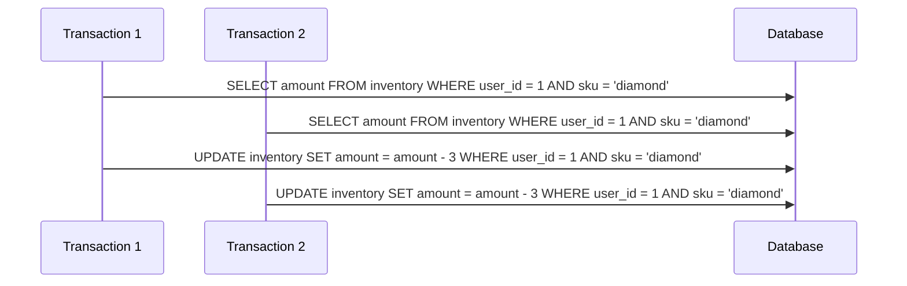
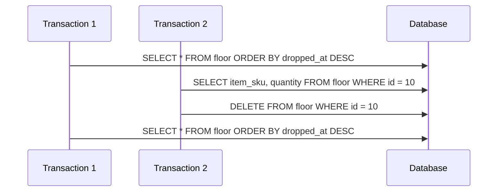
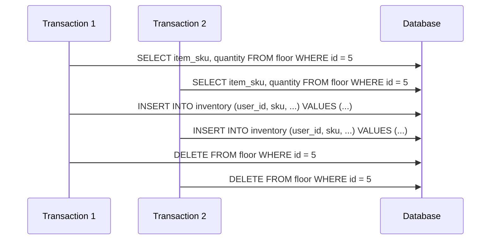

## Case 1: Lost update when dropping same item

Two or more users dro the same item at the same time. One change will overwrite all the other ones.



Solution: Use ```SELECT ... FOR UPDATE``` when updating inventory. This make sure first transaction blocks the row. This will block the other one until it completes, meaning there is no more overwrite. 


## Case 2: Non-repeataable read when veiwing floor items

One player view items on floor and another player picks up an item. When the user viewing the floor items tries to do something with the item that was picked up, the item is gone. 



Solution: Use the ```REPEATABLE READ``` isolation level to make sure floor items remains consistent during the entire transaction.


## Case 3: Write Skew with pickup

Two people try to pick up item at same time. Both see that its on the floor but only one pickup should succeed.



Solution: USe '''FOR UPDATE``` so that it locks the row until the transaction finishes. That way, only one pickup can happen at once.
